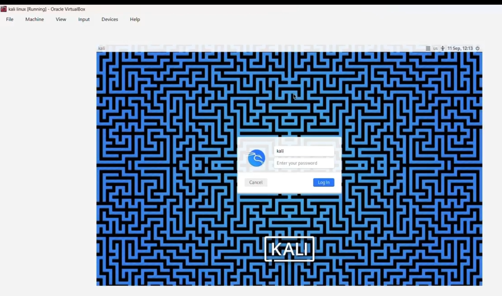
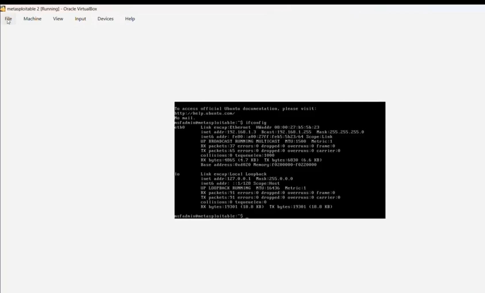
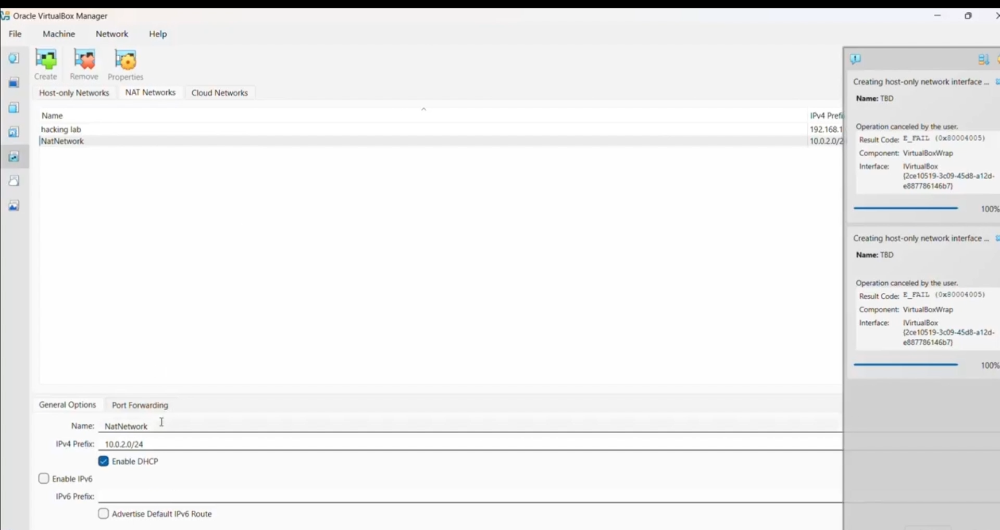
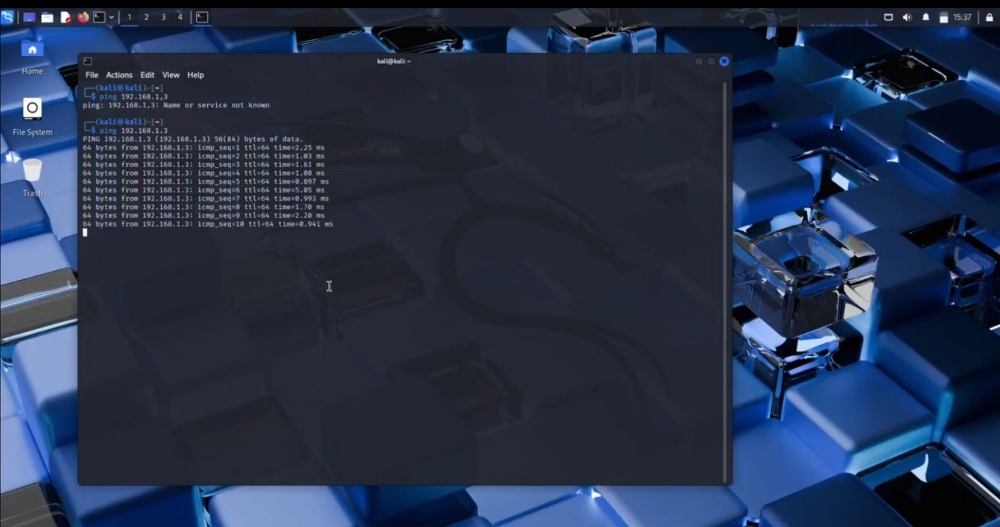
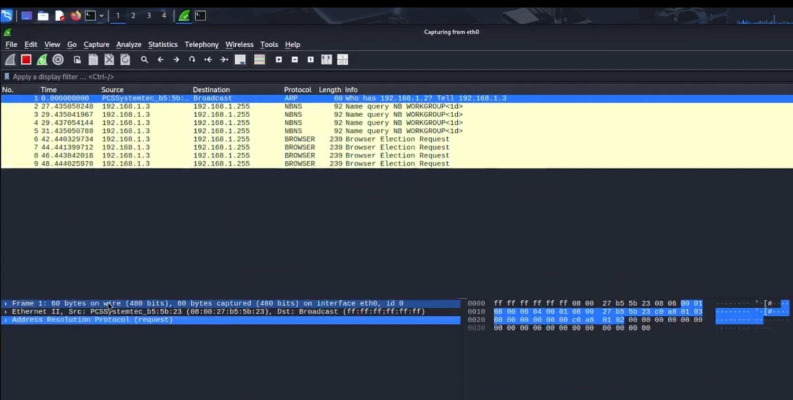

# Task 1 - Lab Environment Setup Report
**ApexPlanet Cybersecurity & Ethical Hacking Internship**

---

## Student Details

| Field | Details |
|-------|---------|
| **Name** | Syed Salman Ahammad |
| **Offer Letter ID** | APSPL2637663 |
| **Email** | syedsalmanahammad2007@gmail.com |
| **Attacker IP** | 192.168.1.27 |
| **Target IP** | 192.168.1.3 |
| **Lab Subnet** | 192.168.1.0/24 |
| **NAT Network** | hacking lab 2 |

---

## 1. Objective

Set up a fully isolated ethical hacking lab environment using VirtualBox with Kali Linux as the attacker machine and Metasploitable2 as the vulnerable target machine — all inside a private NAT network to keep testing safe and isolated from the real network.

This lab validates the **CIA Triad**:
- **Confidentiality** — All scans stay inside the private virtual network, nothing leaks outside
- **Integrity** — Isolated environment keeps test conditions clean and consistent
- **Availability** — RAM is controlled (2048 MB) so the host system stays stable

---

## 2. Lab Machine Specifications

| Machine | OS | RAM | IP Address | Network |
|---------|----|-----|------------|---------|
| Attacker | Kali Linux | 2048 MB | 192.168.1.27 | hacking lab 2 |
| Target | Metasploitable2 | 512 MB | 192.168.1.3 | hacking lab 2 |

---

## 3. Lab Setup Process

### Step 1 — Kali Linux Installation

Downloaded VirtualBox from the official Oracle website and Kali Linux ISO from kali.org. Created a new VM with the following settings:
- RAM: 2048 MB
- Storage: 25 GB
- Desktop: XFCE with Top 10 Tools

Selected **Graphical Install**, set hostname as `kali`, installed GRUB bootloader to `/dev/sda`.


*Figure 1.1 — Kali Linux desktop successfully running inside VirtualBox*

---

### Step 2 — Metasploitable2 Setup

Downloaded Metasploitable2 ZIP from SourceForge, extracted the files, and attached the VMDK disk to a new VirtualBox VM. Booted the machine and logged in using default credentials (`msfadmin / msfadmin`). Ran `ifconfig` to confirm the target IP.


*Figure 1.2 — Metasploitable2 terminal showing ifconfig with IP 192.168.1.3*

---

### Step 3 — Isolated NAT Network Setup

Created a private NAT Network inside VirtualBox named **hacking lab 2** with subnet `192.168.1.0/24`. Bound both Kali and Metasploitable2 network adapters to this network. This ensures all scan traffic stays isolated inside the virtual lab.


*Figure 1.3 — VirtualBox NAT Network hacking lab 2 configured with subnet 192.168.1.0/24*

---

### Step 4 — Connectivity Test (Ping Verification)

Ran a ping test from Kali terminal to the target machine to confirm both machines can communicate inside the lab network.

```bash
kali@kali:~$ ping -c 5 192.168.1.3
```

```
PING 192.168.1.3 56(84) bytes of data.
64 bytes from 192.168.1.3: icmp_seq=1 ttl=64 time=0.421 ms
64 bytes from 192.168.1.3: icmp_seq=2 ttl=64 time=0.380 ms
64 bytes from 192.168.1.3: icmp_seq=3 ttl=64 time=0.405 ms
64 bytes from 192.168.1.3: icmp_seq=4 ttl=64 time=0.392 ms
64 bytes from 192.168.1.3: icmp_seq=5 ttl=64 time=0.388 ms
5 packets transmitted, 5 received, 0% packet loss
```

**Result: 0% packet loss — Connection confirmed**


*Figure 1.4 — Kali terminal showing successful ping to Metasploitable2 at 192.168.1.3*

---

### Step 5 — Wireshark Packet Capture

Launched Wireshark on Kali with root privileges and started capturing on interface `eth0`. Immediately captured live traffic from the target machine.

**Packets captured:**
- **ARP** — Target broadcasting: *"Who has 192.168.1.27? Tell 192.168.1.3"*
- **NetBIOS** — Target identifying itself as `METASPLOITABLE`
- **mDNS** — Service discovery packets from target


*Figure 1.5 — Wireshark actively capturing ARP and NetBIOS packets from Metasploitable2 on eth0*

---

## 4. Key Concepts Learned

### CIA Triad
| Principle | Meaning |
|-----------|---------|
| Confidentiality | Protecting data from unauthorized access |
| Integrity | Ensuring data is accurate and not tampered |
| Availability | Keeping systems accessible when needed |

### Threat Types
| Threat | Description |
|--------|-------------|
| Phishing | Fake emails to steal credentials |
| Malware | Malicious software like virus, trojan, ransomware |
| DDoS | Flooding a server to make it crash |
| SQL Injection | Injecting SQL code into input fields |
| Brute Force | Trying all password combinations |
| Ransomware | Encrypts files and demands payment |

### Networking Concepts
| Concept | Description |
|---------|-------------|
| OSI Model | 7 layers — Physical to Application |
| TCP/IP | Core internet communication protocol |
| DNS | Converts domain names to IP addresses |
| HTTPS | Encrypted web traffic using TLS |
| Subnetting | Dividing networks into smaller segments |
| NAT | Maps private IPs to public IP |

### Cryptography
| Type | Description |
|------|-------------|
| Symmetric | Same key for encrypt and decrypt (AES) |
| Asymmetric | Public + Private key pair (RSA) |
| Hashing | One-way conversion — MD5, SHA256 |
| SSL/TLS | Encrypts browser to server communication |

### Reconnaissance Types
| Type | Description |
|------|-------------|
| Active Recon | Direct interaction with target — ping, Nmap. Leaves logs |
| Passive Recon | No direct contact — Whois, Shodan, DNS. Leaves zero traces |

---

## 5. Tools Used

| Tool | Purpose |
|------|---------|
| VirtualBox | Virtualization software to run VMs |
| Kali Linux | Attacker machine with hacking tools |
| Metasploitable2 | Intentionally vulnerable target machine |
| Wireshark | Packet capture and network analysis |
| Nmap | Network and port scanner |
| Burp Suite | Web application proxy tool |
| Netcat | Network debugging utility |

---

## 6. Conclusion

Successfully built a complete isolated ethical hacking lab with:
- Kali Linux (attacker) and Metasploitable2 (target) running in VirtualBox
- Both machines connected on private NAT network `hacking lab 2`
- Ping test confirmed 0% packet loss between both machines
- Wireshark confirmed live packet capture is working

Lab is fully ready for Task 2 — Network Scanning and Reconnaissance.

---
